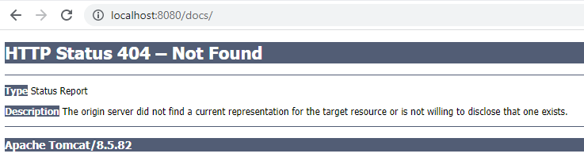
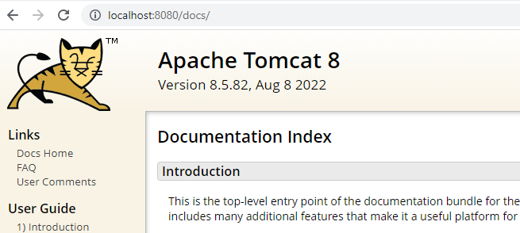
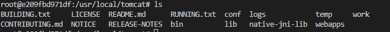
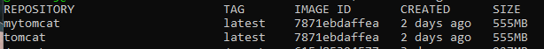
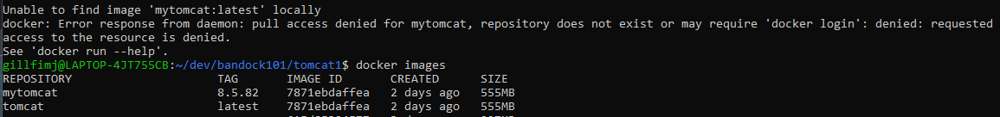

# Building the Tomcat Image
In this exercise we will be building a custom Tomcat image from the official image available on Docker Hub. In the previous lesson, we explored how to search Docker Hub for specific images.For this exercise, we will look for the **latest Tomcat version of 8.5 for OpenJDK 8**. 

To prepare the space for this exercise, create a directory for the customized files called "tomcat1", then change into that directory.

```bash
mkdir tomcat1
cd tomcat1
```

## Create the baseline Tomcat image

Start with the official docker image which can be found at: [https://hub.docker.com/_/tomcat](https://hub.docker.com/_/tomcat)

Create a file called ***Dockerfile*** with the following contents:

```{.dockerfile title=tomcat1/Dockerfile }
FROM tomcat:8.5-jdk8-openjdk

EXPOSE 8080
```

The official image will contain files that may not be wanted in production environment. Let's see what it contains. Build the image and start the container.

```bash
docker build -t tomcat .
docker run -dp 8080:8080 --name tomcat1 tomcat
docker exec -it tomcat1 /bin/bash
```

## Explore the contents of the container. 

* Review the environment variables
* List the contents of the different directories
* Review the log files

Try to access the Tomcat website: [http://localhost:8080](http://localhost:8080)

Try to access the application: [http://localhost:8080/docs](http://localhost:8080/docs)

Is there an error? Hmm...



Let's fix that, while we're in the docker container:

```bash
root@54f2abb279c1:/usr/local/tomcat# mv webapps.dist/docs/ webapps/
```

Now try to access the application again: [http://localhost:8080/docs](http://localhost:8080/docs)

Looks quite different now.



## Simple modifications to the baseline image

Remove the webapps.dist from the container build by modifying the Dockerfile.

```{.dockerfile title=tomcat1/Dockerfile }
FROM tomcat:8.5-jdk8-openjdk

RUN rm -Rf $CATALINA_HOME/webapps.dist

EXPOSE 8080
```

Rebuild the image. Note, we'll need to stop and remove the current container first. Since we're modifying the image, we're going to change the image name from the baseline just so we can differentiate between the two.

```bash
docker stop tomcat1
docker rm tomcat1
docker build -t mytomcat .
docker run -d -p 8080:8080 --name tomcat1 mytomcat
docker exec -it tomcat1 /bin/bash
```

Let's look inside the container again and make sure the directory we removed is gone.



## Multiple commands at once

How do we know if the Tomcat image is up to date with the patching of packages? We don't. Let's make sure that happens by adding some lines to the RUN command.

```{.dockerfile title=tomcat1/Dockerfile }
RUN rm -Rf $CATALINA_HOME/webapps.dist \
 && apt-get update -y  \
 && apt-get upgrade -y
```

Since we need to go through the same steps to stop and rebuild the contain - AGAIN - let's write a script to do that. Seems like it might be useful.

```{.bash title=build.sh}
export CNTRNAME=$1
export APPIMG=$2

echo "Shutting down container..."
docker stop $CNTRNAME
docker rm $CNTRNAME

echo "Removing image..."
docker rmi $APPIMG
docker build -t $APPIMG .
docker run --name $CNTRNAME -p 8080:8080 -d --restart unless-stopped  $APPIMG
```

Note the new statement being executed "docker rmi". This will remove the image from the image repository. This can be useful if requiring a fresh version of the image without putting a version number on it.

What about making a consistent directory for application logs?

```{.dockerfile title=tomcat1/Dockerfile }
ENV APP_LOGS=/app_logs

RUN rm -Rf $CATALINA_HOME/webapps.dist \
 && mkdir -p $APP_LOGS \
 && apt-get update -y  \
 && apt-get upgrade -y \
```

Is there anything else we can do to customize the image before we're ready to call it good to use?

```{.dockerfile title=tomcat1/Dockerfile }
RUN rm -Rf $CATALINA_HOME/webapps.dist \
 && mkdir -p $APP_LOGS \
 && apt-get update -y  \
 && apt-get upgrade -y \
 && apt-get install -y python3-pip locales xtail gawk \
 && apt-get remove -y build-essential subversion mercurial git openssh-client 'libfreetype*' curl \
 && apt-get purge -y openssh-client \
 && apt-get clean autoclean -y \
 && apt-get autoremove -y \
 && rm -rf /var/lib/apt/lists/*
```

Let's build this one more time and we should have a good Tomcat image to use as a base for all our applications.

```bash
. ../build.sh tomcat1 mytomcat
```

Now look around the Tomcat environment to make sure there isn't anything else you want to do that should be reflected across all instances.

```bash
docker exec -it tomcat1 /bin/bash
```

All looks good. We can shut down and remove the Tomcat container since we really don't need it running. We just wanted to verify its contents and we've done that. The important part now is the image which we can use with any applications we build.

```bash
docker stop tomcat1
docker rm tomcat1
docker images
```

The list of images should show our newly created tomcat image.



## Tagging the Tomcat image

The default tag on the image is "latest". That's fine for a single image. What if you need to track images by version. At some point, Tomcat will need to be updated and you may not want all of your containers running the "latest" version yet because you want to test things out first. Tagging can help describe images in a bit more detail. Right now, we have no idea what version of Tomcat our newly created image is using. That is probably not a good thing. Let's fix that.

```{.bash title=build.sh}
# 
# Parameters:
#   1 - Container name
#   2 - Image name to be created
#   3 - Application version to be used in the tagging of the image
#   4 - Local port which the application will be mapped to once started
#
# Usage: . build.sh <containerName> <imageName> <version> <port>
#
CNTRNAME=$1
APPIMG=$2
APPVER=$3
PORTNUM=$4

echo "Shutting down container..."
docker stop $CNTRNAME
docker rm $CNTRNAME

echo "Removing image..."
docker rmi $APPIMG
docker build -t $APPIMG:$APPVER .
docker run --name $CNTRNAME -p $PORTNUM:8080 -d $APPIMG
```

Let's check it out.

```bash
. ../build.sh tomcat1 mytomcat 8.5.82 8080
```

Oh no! We got an error. What did we forget to do?



When we built the image with the tag that included the version, we failed to include that tag on the "run" statement.

```{.bash title=build.sh}
docker run --name $CNTRNAME -p $PORTNUM:8080 -d $APPIMG
```

Easy fix. Let's make sure we didn't miss anything else.

```{.bash title=build.sh}
docker rmi $APPIMG:$APPVER

docker run --name $CNTRNAME -p $PORTNUM:8080 -d $APPIMG:$APPVER
```

## Enable locale support
While browsing the image layers of the Official Tomcat image, we noticed the LANG variable was set to C.UTF-8. That's not a support value for Banner applications. Let's address that.

```{.dockerfile title=tomcat1/Dockerfile }
### Locale support for en_US.UTF-8 according to Ellucian Article 000009690
RUN touch /usr/share/locale/locale.alias \
 && sed -i '/en_US.UTF-8/s/^# //g' /etc/locale.gen \
 && locale-gen
 
ENV LANG en_US.UTF-8 \
    LANGUAGE en_US:en \
    LC_ALL en_US.UTF-8
### Locale support END ###
```

## Secure container
What do you notice about the container when you enter it?

```bash
docker exec -it tomcat1 /bin/bash
root@f73ed5a6b708:/usr/local/tomcat#
```

The user the container is running as is **root**. According to security best practices, that's bad. Let's address that.

```{.dockerfile title=tomcat1/Dockerfile }
RUN groupadd -r -g 10001 tomcat \
 && useradd -rm -g tomcat -s /bin/bash -u 10000 tomcat \
 && chgrp -R tomcat $CATALINA_HOME \
 && chmod -R g-w $CATALINA_HOME \
 && chmod -R g+rX $CATALINA_HOME \
 && cd $CATALINA_HOME \
 && touch bin/setenv.sh \
 && mkdir -p logs temp webapps work conf \
 && chown -R tomcat bin logs temp webapps work conf $APP_LOGS \
 && ln -sf /usr/share/zoneinfo/US/Central /etc/localtime

USER tomcat
```

Now check to see what user we're logged in as:

```bash
docker exec -it tomcat1 /bin/bash
tomcat@bce46116277f:/usr/local/tomcat$
```

It looks like we're making great progress. But we really only need this to be built as an image and not a full running container. Let's build a specific script just to build the image and not run a container. We're also going to set it up to push to a remote repository.

```{.bash title=tomcat1/buildspec.sh}
#
# Parameters:
#   1 - Image name to be created
#   2 - Application version to be used in the tagging of the image
#   3 - One-up build number to generate
#
# Usage: . buildspec.sh <imageName> <version> <number>
#   Example: . buildspec.sh tomcat 8.5.82 1 dockergenius17
#
IMAGE_REPO_NAME=$1
APP_VERSION=$2
BUILD_NUM=$3
ACCOUNT_INFO=$4 #<your docker hub account>

echo "Building the Docker image..."
docker build -t $IMAGE_REPO_NAME:$APP_VERSION-$BUILD_NUM .
#Setup for pushing to remote docker repository
docker tag $IMAGE_REPO_NAME:$APP_VERSION-$BUILD_NUM $ACCOUNT_INFO/$IMAGE_REPO_NAME:$APP_VERSION-$BUILD_NUM
docker push $ACCOUNT_INFO/$IMAGE_REPO_NAME:$APP_VERSION-$BUILD_NUM
```

This script will allow the creation of the image with a specific build number in case there is a need to run different images at the same time.

The tag and push commands will allow the image to be pushed to an image repository which can then be pulled from a remote location. This is good when needing to reference the images from multiple locations. The images that have been created up to now have all been pushed to the local repository on the machine and cannot be referenced outside of that machine. This is why it is essential to have access to a remote repository of some sort.

Let's create a version of our custom tomcat image with a specific build number.

```bash
. buildspec.sh mytomcat 8.5.82 1 dockergenius17
```

We are now ready to use this image with a Banner application! Make note of the image name, version and build number used as those will be needed in the next task. ***NOTE: your build number may not match the build number in this example or the build number used in future lessons.***

If you get logged out of your docker hub account you may get a permissions denied error when trying to push the image to your repository. If that happens, just log back in to your docker hub account as follows:

```bash
docker login
Username: dockergenius17
Password:
```


