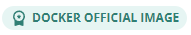
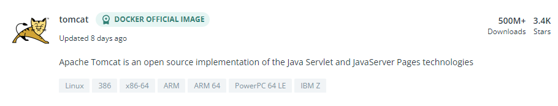

# Getting Familiar with Docker Hub
## What is Docker Hub

Docker Hub is a library of images and a place to store and share custom images with others in a community environment.

## Register on Docker Hub

Let's setup a free account. Go to <a href="https://hub.docker.com/" target="_blank">https://hub.docker.com/</a>

Enter the necessary information and click Sign Up.

Docker will send a verification email to the email address entered on the sign-up page. Click on the link in the email, then go back to Docker Hub and login with the newly created account.

Let's explore a bit. The menu at the top of the page provides the gateway to all that the Docker Hub has to offer.

## Explore

Explore allows you to browse the vast list of images available in the Docker repositories. At any point, you can use the search box to search for images within the site. Be careful, though. Anyone can post images to the repositories on this site. Some images are officially supported by Docker, some are not. It is important to know the difference. Official images supported by Docker will be identified with the following graphic:

For the purposes of this workshop, we'll be using the official Tomcat image supported by Docker. 

## Repositories

Repositories shows the list of your the repositories in your account. You can create public or private repositories for specific projects. In a free Docker Hub account, you can have only 1 private repo but any number of public repos. For the purpose of this workshop, we'll be creating a repository to store the images we create.

Let's create two repositories, one for Tomcat and one for a Banner application:

* Click on 
* Enter a name for the repository, like "***mytomcat***".
* Enter a description for the repository, like "***Custom Tomcat for Banner docker training at CoHEsion 2022***."
* Choose either public or private, keeping in mind that you only have 1 private repository available.
* Click Create 

Repeat the above steps for creating a Banner Application repository. We'll use Application Navigator as an example.

You should now have two repositories. We will come back to these later in the workshop.

## Searching the Repo

Let's search for the Tomcat image we're going to be using. In the Search box type "***tomcat***"

The search list will return all repositories having to do with Tomcat. Notice the Docker Official Image icon on the first item in the list. This indicates we've found the official repository, but let's browse the list first. Scroll down the list and review the different options. Many people have posted their Tomcat images to their public repositories. When you create a public repository, your's too could end up in a search listing like this. Notice there are over 40,000 search results.

Now search for mytomcat and notice how the search results have gone down to about 2,000. Now change the sort option from Best Match to Recently Updated. What do you notice?

Security note: Docker hub is great for learning purposes. However, it if you are going to use it for university business, buy a license and create all repositories as private. Never push university owned objects to a public repository. If you don't want to pay for Docker Hub access, Gitlab has a built-in container registry feature. Gitlab can be installed and managed locally without cost.

Let's get back to the Official Tomcat Image. Search for tomcat again, this time click anywhere in the box for the official image.

Tags are the different versions of the images that are available. The tag is important to know as the Banner applications aren't always supported on the latest version of Tomcat. It looks like the latest available Tomcat image is v10.1.x.

We'll probably need a different version. Let's look for v8.5. Click on the Tags tab, next to Overview.

In the Filter box type: "***8.5***". That seems to have reduced the list of images, but there still seems to be quite a long list. Let's narrow that down a bit more. We know that Banner applications must run with JDK v8 if running with Grails v3 or JDK v11 if running with Grails v5 (applications released after September 2022). Let's change the file to "***8.5-jdk8***". That should have reduced the list of images to a single page.

Scroll through the list of images and locate the one for openjdk:

Click on the link to review how the image was built. Each layer in the build process is just another step that would have been done manually. Linux commands, environment variables getting set, scripts being run. If you've ever installed Tomcat, most of this should look familiar. Review the different layers. What do you notice?

* What OS is being used?
* What is the value of LANG and is it a supported value for Banner applications?
* What packages are being installed and are they really necessary for a Banner environment?
* Where are the default Tomcat applications?

Note the repository and tag notation on the pull command:

We'll need this later in the workshop.

Search Review

* Find the right image to use by narrowing the search filter
* Review the Image Layers used to create the image to fully understand what the image contains
* Note the Pull command contents - this will be used in the Dockerfile we will create
