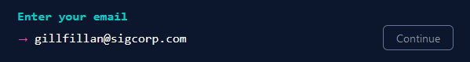
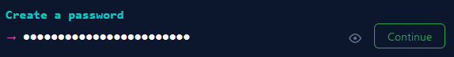
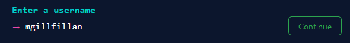
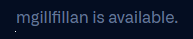
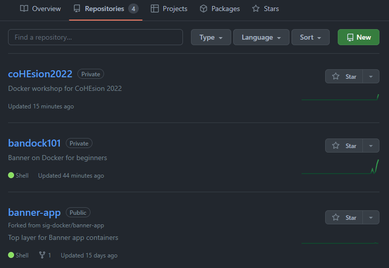
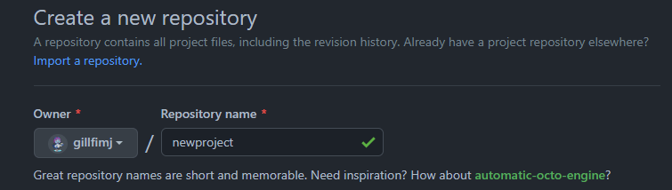
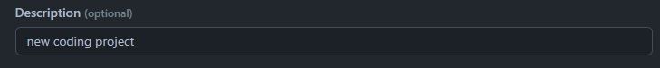
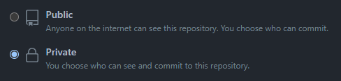
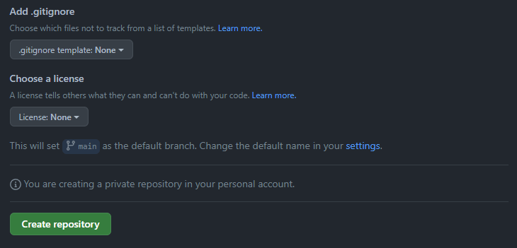

# Setting up a new account

Github is a platform that provides a service for hosting repositories for source code management. For those interested in getting started in source code management, Github provides the ability to create free accounts to create public and/or private repositories that can be shared for any project imaginable.

While public repositories are open to anyone, access to private repositories is granted only to specific accounts. Here's a quick way to get started.

## Getting started

It is a good idea to create an account in Github if you plan to do any kind of significant source code management. Even if you just want to browse around and don't have any current plans to create a new repository, at some point you will need an account.

Go to: https://github.com/

Click the Sign up button in the upper right corner

### Provide Email address

Enter a valid email address.  This can be any email address of your choice. 

### Create password

Enter a password according to the designated password rules.

### Create username

Enter a username that is relatively unique but yet something that will help others know who you are as this will be used to tag any updates to the repository.  This is what you'll use to login.

If the username is available, the Continue button will activate and a message will display below that says the account is available.

Make sure to take note of each value so you know how to login next time.

### Receive product updates?

You may be asked if you want to receive product updates.  Feel free to answer that question as you wish.

You will then be asked to verify you are human.  Good luck with that.

### Create Account

Then you can click the button to Create Account

### Enter Launch Code

You will then be sent a Launch Code to verify your email address. Check your email at the address you provided and enter the Launch Code to continue with the setup process.

### Setup questions

You may then be asked a series of setup questions.
* How many team members will be working with you?
* Are you a student or teacher?
* What specific features are you interested in using?
 
Feel free to skip the personalization

### MFA and other stuff

If you're new to Git and/or Github, feel free to read the guide that is provided on the Dashboard as you first login.
* Warning, this is a rabbit hole you can wind down for a while, so tread cautiously.

We highly encourage the use of 2 Factor Authentication whenever possible.  Github provides the flexibility of choosing which Authenticator you want to use.  Just make sure you remember which Authenticator you link your account to and be sure to download your recovery codes, so when you forget which Authenticator you've link your account to you have a way to get back into your account.

# Create New Repository

All source code related to a given project should be stored in a single repository. The repository will provide an step-by-step account of who updated what and when it when was updated. This can be a valuable asset to auditors as well as developers, especially if code needs to be rolled back for any given reason.

## Starting a new repository

On the Main Github screen, click the Repositories tab at the top of the screen. This will display a list of repositories to which you current have access. On the right of the screen, click the New button.

### Repository Name

After you click on the New button, you will need to give your repository a name. This name needs to be unique to your account. No two repos can have the same name. Enter the new repository name.

### Repository Description

The repository description is optional. However, it can be helpful to know why this repo exists and what its purpose is. Keep it short, but descriptive.

### Repository type

You can identify whether this repo will be public or private. Public repos can be seen by anyone. Private repos are, well, private. You must grant specific access to a private repo. This can be one way to provide a level of security around your coding project.

### Add a README file

Adding a README file to the repository will give your visitors an idea of what your repository contains. This is where you can provide instructions on how to download the contents, prepare the environment, run your code and any other important information to get your visitors started with your project.

### Other Misc Settings

You can also add a template for the .gitignore file. If there are files that you do not want to include in the repository, you can add them to the .gitignore file. This is good for ignoring sensitive data that should never appear in a code repository or temporary files that have no real purpose.

You can also include a license file which tells others what they can and cannot do with your code.

Once you are satisfied with the options, click Create Repository to recreate your new repository.

