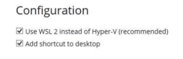

# Setting up Docker Desktop on Windows

Before installing Docker Desktop on Windows, we'll need to install the Windows Subsystem for Linux 2. This will create a Ubuntu Linux environment from which we we'll interact with Docker once it is installed. Before proceeding, make sure you have Administrative rights on the machine where these installations will occur. Windows 11 was used as the basis for these illustrations, however, Windows 10 can also be used.

## Install Windows Subsystem for Linux 2 (WSL2)

To install WSL2 on Windows 10 or Windows 11, please review the prerequisites at:

<a href="https://docs.docker.com/desktop/install/windows-install/" target="_blank">https://docs.docker.com/desktop/install/windows-install/</a>

***Please note, you do not need to run Hyper-V in order to run Docker Desktop on Windows. If you're going down the path of turning on Hyper-V stop. It's not needed for this exercise.***

Review the installation procedure at: 

<a href="https://docs.microsoft.com/en-us/windows/wsl/install" target="_blank">https://docs.microsoft.com/en-us/windows/wsl/install</a>

Open Windows Powershell as administrator and enter the following command to install wsl (yes it is that simple.)

```powershell
wsl --install
```

Reboot the machine. You should notice that Ubuntu is installing during the reboot process. Once the reboot is completed, a Ubuntu window will open and you will be asked to enter a username and password for your new Linux environment. Try to keep track of these credentials as they will be needed again.

With WSL2 installed, you can now install Docker Desktop for Windows.

## Download Docker Desktop for Windows

Download the Docker installer executable at:

<a href="https://desktop.docker.com/win/main/amd64/Docker%20Desktop%20Installer.exe" target="_blank">https://desktop.docker.com/win/main/amd64/Docker%20Desktop%20Installer.exe</a>

The file will attempt to download to your Downloads directory. Feel free to redirect that as needed, just remember where you put it.

## Install Docker Desktop for Windows

Once the download completes, double click the executable and follow the prompts. There are not too many, but the most important one to note is the Configuration screen making sure that you want to install the version for WSL2 instead of Hyper-V. If WSL2 is installed properly, the installer should default to this option without issue.


* ***Since WSL 2 is installed, verify that the box for "Use WSL 2 instead of Hyper-V" is automatically checked.***



After answering all the prompts, restart your machine.

Once the machine is restarted, startup Docker Desktop. As Docker Desktop starts up, it will present a licensing window.

### Licensing

If you're using Docker Desktop for personal use, Docker Desktop remains free to use. For the purposes of this workshop, let's consider this personal study.

Please review the FAQs for more details related to the licensing of Docker Desktop: 

<a href="https://www.docker.com/pricing/faq/" target="_blank">https://www.docker.com/pricing/faq/</a>.

#### Getting around the licensing issue

If you really want to get around the licensing restrictions for Docker Desktop, you can manually install the Docker CLI components into your Ubuntu environment once WSL2 is configured, then install Portainer as a GUI view into your containers. Here's a reference on how to get started:

<a href="https://betterprogramming.pub/how-to-install-docker-without-docker-desktop-on-windows-a2bbb65638a1" target="_blank">https://betterprogramming.pub/how-to-install-docker-without-docker-desktop-on-windows-a2bbb65638a1</a>

## Testing the Docker Desktop Installation

From a command line check the docker version

```bash
docker --version

Docker version 20.10.17, build 100c701
```

Let's run a very simple container

```bash
docker run hello-world

Unable to find image 'hello-world:latest' locally
latest: Pulling from library/hello-world
2db29710123e: Pull complete
Digest: sha256:62af9efd515a25f84961b70f973a798d2eca956b1b2b026d0a4a63a3b0b6a3f2
Status: Downloaded newer image for hello-world:latest

Hello from Docker!
This message shows that your installation appears to be working correctly.

To generate this message, Docker took the following steps:
 1. The Docker client contacted the Docker daemon.
 2. The Docker daemon pulled the "hello-world" image from the Docker Hub.
    (amd64)
 3. The Docker daemon created a new container from that image which runs the
    executable that produces the output you are currently reading.
 4. The Docker daemon streamed that output to the Docker client, which sent it
    to your terminal.

To try something more ambitious, you can run an Ubuntu container with:
 $ docker run -it ubuntu bash

Share images, automate workflows, and more with a free Docker ID:
 https://hub.docker.com/

For more examples and ideas, visit:
 https://docs.docker.com/get-started/
 ```

 Ok, so it looks like we have a good installation of Docker Desktop. We can continue with our lessons.