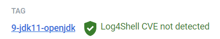

# Updating Images
## Updating the Tomcat Image

It's time to upgrade Tomcat from one version to another. Seems like that might be a daunting task. Not really.

For this exercise, we're going to upgrade the Tomcat image from using JDK 8 to JDK 11, something that will be required for the Grails 5 upgrade. Just for kicks, we may even upgrade from Tomcat 8 to Tomcat 9.

Open the Tomcat Dockerfile and find the line where the version of Tomcat is specified.

```{.dockerfile tomcat1/Dockerfile}
FROM tomcat:8.5-jdk8-openjdk
```

Go out to Docker Hub and search for the official tomcat image page

<a href="https://hub.docker.com/_/tomcat" target="_blank">https://hub.docker.com/_/tomcat</a>

Search for the latest version of Tomcat, for the JDK 11 openjdk version
* Click on the Tags tab
* In the Filter box type: 9-jdk11-openjdk
* Scroll down until you find the right image
 
    

* Click on the identified image link
* Verify the JDK and tomcat versions

```dockerfile
ENV JAVA_VERSION=11.0.16

ENV TOMCAT_VERSION=9.0.65
```

Looks like we found what we need. Make note of the image name as that is what we'll need to update our tomcat image.

```plaintext
tomcat:9-jdk11-openjdk
```

Now that know what official Docker image to reference, replace the value in the tomcat Dockerfile with what we just found:

```{.dockerfile title=tomcat1/Dockerfile}
FROM tomcat:9-jdk11-openjdk
```

Now rebuild your image with a new tag showing the version of Tomcat if you want. Then verify that your image was created.

```bash
. buildspec.sh mytomcat 9.0.65 1

docker images
...
mytomcat              9.0.65-1   1370ebfdaaf4   8 minutes ago   824MB
```

Terrific! We have an new Tomcat image we can use with Banner applications. Let's move on and upgrade our Banner container.

## Updating the Banner Containers

Open the Dockerfile for the Banner application and find the FROM line where the tomcat image is specified.

```{.dockerfile title=applicatonNavigator/Dockerfile}
FROM mytomcat:8.5.82-2
```

Change the version to the new image version just created:

```{.dockerfile title=applicatonNavigator/Dockerfile}
FROM mytomcat:9.0.65-1
```

Save the file and rebuild the container.

```bash
. build.sh applicationNavigator appnav 3.7 8081
```

Check the log file and see how the container build went

```bash
docker logs applicationNavigator -f

*** warning - no files are being watched ***
bin/catalina.sh: line 421: /usr/local/openjdk-8/bin/java: No such file or directory
```

Something went wrong. Apparently, we missed changing an environment variable. Let's take care of that.

```dockerfile
ENV TOMCAT_JAVA_HOME="/usr/local/openjdk-11" \

```

Let's try that build again and check the logs

This time it turned out better. Let's jump in the container and check a few things.

* Check the environment variables
* Check the /usr/local/openjdk-11 to make sure it exists
* Run bin/version.sh to check the version of tomcat
* The jar files will work fine with JDK 11 so no need to update those.

If everything looks good - congrats - you just upgraded Tomcat and JDK! Rinse/Repeat for every other application.

## Application Update recap
* Update FROM version
* Update JAVA_HOME environment variable
* Rebuild container

